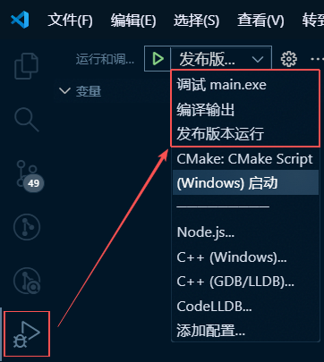

# FTC - 批量文件格式转换工具

一个基于 C/C++ 语言和 FFmpeg 的多功能文件格式转换工具，支持批量处理和交互式操作。

## 🚀 项目简介

该项目由本人在学习 C 语言和 FFmpeg 过程中独立开发完成。虽然只是一个简单的文件转换工具，但在路径处理、内存管理、用户交互等方面投入了大量精力，具有很好的扩展性和代码结构。

**特点**：
- ✅ 完全独立开发，无参考借鉴
- ✅ 代码结构清晰，易于扩展新功能
- ✅ 完善的错误处理和内存管理
- ✅ 支持中文字符和 UTF-8 编码

## ✨ 功能特性

- 🎯 **批量文件格式转换** - 支持多种图片/视频/音频格式转换
- 📁 **智能路径处理** - 自动解析文件路径、父目录、文件名和扩展名
- 🔄 **交互式操作** - 友好的命令行菜单界面
- 🎨 **全局路径管理** - 支持路径的合并、显示和统一管理
- ⚡ **高效处理** - 支持多文件批量转换
- 🔧 **模块化设计** - 每个功能独立封装，易于维护和扩展

## 📋 当前功能状态

### ✅ 已实现功能
1. **文件格式转换** - 完整的格式转换流程
2. **交互式路径输入** - 支持拖拽文件获取路径
3. **全局路径管理** - 统一的路径存储和管理
4. **路径列表输入** - 完善的路径识别功能
5. **路径列表显示** - 实时查看当前处理的文件


### 🚧 开发中功能
- [ ] 路径清除功能
- [ ] 包含 FFmpeg 静态库的独立版本
- [ ] 更详细的参数设置
- [ ] 日志系统
- [ ] 图形界面
- [ ] 用户输入文件数量提升(char input[2048];)
- [ ] 指定输出目录

## 🛠️ 支持的格式

### 图片格式 ✅
```bash
.png, .jpg, .jpeg, .bmp, .gif, .tiff, .tif
.webp, .ico, .svg, .psd, .raw, .cr2, .nef
.pgm, .ppm, .pbm, .pnm, .dpx, .exr, .hdr
```

### 视频格式 ✅
```bash
.mp4, .avi, .mkv, .mov, .wmv, .flv, .webm
.m4v, .3gp, .ogv, .ts, .mts, .m2ts
.mxf, .vob, .asf, .rm, .rmvb, .divx
```

### 音频格式 ✅
```bash
.mp3, .wav, .aac, .flac, .ogg, .m4a, .wma
.opus, .ac3, .aiff, .ape, .tta
```

## 🎯 使用方法

### 前提条件
- **FFmpeg**: 需要安装 FFmpeg 并添加到系统 PATH 环境变量
- **编译器**: GCC (MinGW-w64 或 MSYS2)

### 使用方式

#### 方式1: 拖拽文件使用 (推荐)
直接将文件拖拽到程序图标上运行，自动导入文件路径。

 


#### 方式2: 命令行参数
```bash
main.exe "file1.png" "file2.jpg" "file3.gif"
```

#### 方式3: 交互式菜单
运行程序后选择功能：
```
1. 文件格式转换 (当前有 X 个文件)
2. 输入文件路径
3. 显示当前路径列表
0. 退出
```


## 📁 项目结构

```
FTC/
├── source/                 # 源代码目录
│   ├── main.cpp              # 主程序入口 & 全局路径管理
│   ├── main.h                # 主头文件 & 全局变量声明
│   ├── function1.cpp         # 文件格式转换功能
│   ├── function1.h           # 功能1头文件
│   ├── function2.cpp         # 交互式路径输入功能
│   ├── function2.h           # 功能2头文件
│   ├── file_path_processing.cpp  # 文件路径处理核心功能
│   ├── file_path_processing.h    # 路径处理头文件
│   ├── ffmpeg_using.cpp     # FFmpeg 功能封装
│   ├── ffmpeg_using.h       # FFmpeg 头文件
│   ├── init.cpp             # 程序初始化
│   ├── init.h               # 初始化头文件
│   ├── animation.cpp        # 控制台动画效果
│   └── animation.h          # 动画头文件
├── output/                  # 编译输出目录
│   ├── debug/               # 调试版本
│   └── release/             # 发布版本
├── release/                 # 发布文件目录
│   └── main.exe             # 测试过的可执行文件
├── .vscode/                 # VSCode 配置
│   ├── launch.json          # 调试配置
│   └── tasks.json           # 构建任务
└── Docs/                    # 文档资源
    └── Picture/             # 图片资源
```

## 🔧 编译说明

### 使用 VSCode 编译 (推荐)

1. **安装 VSCode** 和 **C/C++ 插件**
2. **打开项目文件夹**
3. **配置编译路径**：
   - 修改 `tasks.json` 中的 GCC 路径
   - 修改 `launch.json` 中的 GDB 路径
4. **开始调试**：选择菜单栏「调试」→「开始调试」



### 手动编译命令

**调试版本**：
```bash
gcc -g -o ./output/debug/main.exe ./source/*.cpp
```

**发布版本**：
```bash
gcc -O2 -s -o ./release/main.exe ./source/*.cpp
```

## 📚 核心 API

### 全局路径管理 (`main.cpp`)
```c
extern char **g_global_paths;     // 全局路径数组
extern int g_global_path_count;   // 全局路径数量

int merge_paths_to_global(char **new_paths, int new_count);  // 合并路径到全局
void print_global_paths();        // 显示路径列表
```

### 文件路径处理 (`file_path_processing.cpp`)
```c
// 文件信息结构
typedef struct {
    char *file_path;              // 完整路径
    char *parent_path;            // 父目录
    char *filename_without_ext;   // 无扩展名文件名
    char *ext;                    // 文件扩展名
} FileInfo;

void get_multiple_file_info(int argc, char *argv[], FileInfo *file_info);
void combine_paths_count(FileInfo *file_info, char **output_path, const char *ext, int count);
int split_paths(const char *input, char ***paths);  // 路径分割
void free_paths(char **paths, int count);           // 内存释放
```

### 格式转换 (`function1.cpp`)
```c
int function1(int argc, char *argv[]);              // 格式转换主功能
int file_type_change(int argc, char *argv[], char *newtype);  // 类型转换
```

### 交互式输入 (`function2.cpp`)
```c
int function2();                                    // 交互式路径输入
int split_path_from_user(char ***paths);            // 用户输入处理
```

### FFmpeg 封装 (`ffmpeg_using.cpp`)
```c
int ffmpeg_convert(const char *input, const char *output);  // 格式转换
```

## 🎮 使用示例

### 基本使用流程
1. **启动程序**：双击 `main.exe` 或通过命令行启动
2. **添加文件**：
   - 方式1：启动时通过命令行参数添加
   - 方式2：在菜单中选择功能2，拖拽文件添加
3. **格式转换**：选择功能1，输入目标格式（如 `png`）
4. **查看结果**：转换完成后在原始文件同目录查看新文件

### 交互示例
```
当前工作目录: C:\Projects\FTC

1. 文件格式转换 (当前有 3 个文件)
2. 输入文件路径  
3. 显示当前路径列表
0. 退出
▶ 2

▲▼▲请拖入文件,支持多个▲▼▲
▶ [拖拽文件到这里]

▲Found 2 paths:
  0: C:\Users\test\image1.jpg
  1: C:\Users\test\image2.png

按回车键继续...
✅ FUNCTION2 DONE

▲ 合并成功，总路径数: 5
```

## ⚠️ 注意事项

1. **FFmpeg 依赖**：必须安装 FFmpeg 并配置系统 PATH
2. **路径格式**：支持带空格的路径，自动处理引号
3. **内存安全**：所有动态内存都妥善管理，避免泄漏
4. **编码支持**：自动处理本地编码到 UTF-8 的转换
5. **错误处理**：完善的错误检查和用户提示

## 🔮 未来计划

- [ ] **路径管理增强** - 添加路径删除、清空功能
- [ ] **独立版本** - 封装包含 FFmpeg 静态库的版本
- [ ] **图形界面** - 开发可视化操作界面
- [ ] **配置系统** - 支持配置文件保存设置
- [ ] **日志系统** - 详细的运行日志记录
- [ ] **更多格式** - 支持更多专业格式转换

## 📄 许可证

本项目采用 MIT 许可证 - 详见 [LICENSE](LICENSE) 文件

## 📞 联系方式

- **作者**: nywerya
- **邮箱**: nywerya@gmail.com  
- **GitHub**: [https://github.com/Mamekokwai](https://github.com/Mamekokwai)

---

**温馨提示**: 项目处于活跃开发阶段，API 和功能可能会有调整。欢迎反馈问题和建议！
